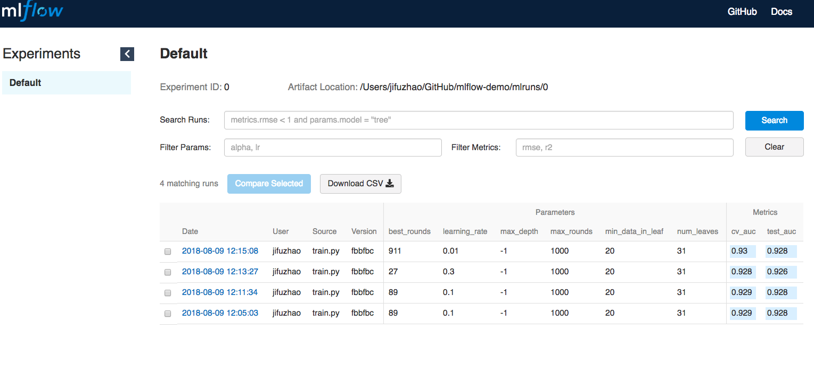

# mlflow-demo
Simple Demo of MLflow Project with LightGBM

***
## Data

***
## Feature Engineering


***
## Modeling


***
## How to run the code

* Method 2:

```console
$ git clone https://github.com/JifuZhao/mlflow-demo.git
$ cd mlflow-demo/
$ python train.py ./data/train.csv ./data/test.csv 1000 0.1 31 -1 20
```

After running, you can view the result through MLflow UI:

```console
$ mlflow ui
```

In the browser, go to `http://127.0.0.1:5000`, you will get the following results.




***
## Example MLflow projects:
* [mlflow/mlflow-example](https://github.com/mlflow/mlflow-example)
* [mserrate/mlflow-sample](https://github.com/mserrate/mlflow-sample)
* [dmatrix/jsd-mlflow-examples](https://github.com/dmatrix/jsd-mlflow-examples)

